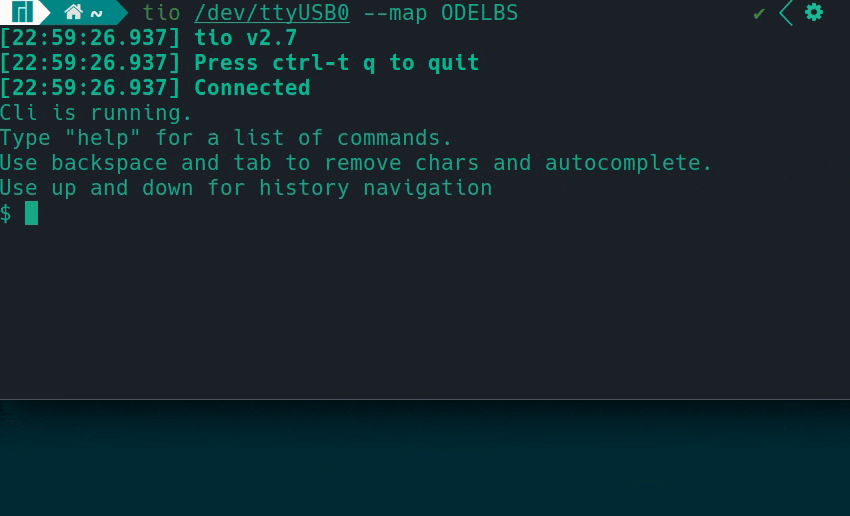

# embedded-cli

> **Command Line Interface for embedded systems**

[](https://crates.io/crates/embedded-cli)
[](LICENSE-APACHE)
[](LICENSE-MIT)
[](https://github.com/funbiscuit/embedded-cli-rs/actions/workflows/ci.yml?query=branch%3Amain)
[](https://app.codecov.io/github/funbiscuit/embedded-cli-rs)

[Demo](examples/arduino/README.md) of CLI running on Arduino Nano.
Memory usage: 14KiB of ROM and 0.5KiB of static RAM. Most of static RAM is used by help strings.



Dual-licensed under [Apache 2.0](LICENSE-APACHE) or [MIT](LICENSE-MIT).

This library is not stable yet, meaning it's API is likely to change.
Some of the API might be a bit ugly, but I don't see a better solution
for now. If you have suggestions - open an Issue or a Pull Request.

## Features

- [x] Static allocation
- [x] UTF-8 support
- [x] No dynamic dispatch
- [x] Configurable memory usage
- [x] Declaration of commands with enums
- [x] Left/right support (move inside current input)
- [x] Parsing of arguments to common types
- [x] Autocompletion of command names (with tab)
- [x] History (navigate with up and down keypress)
- [x] Help (generated from doc comments)
- [x] Formatted write with [ufmt](https://github.com/japaric/ufmt)
- [x] No panicking branches in generated code, when optimized
- [x] Any byte-stream interface is supported (`embedded_io::Write` as output stream, input bytes are given one-by-one)
- [ ] Move inside current input with left/right keypress
- [ ] Colors through ANSI escape sequences
- [ ] Navigation through history with search of current input
- [ ] Support wrapping of generated str slices in user macro (useful for arduino progmem)

## How to use

### Add dependencies

Add `embedded-cli` and necessary crates to your app:

```toml
[dependencies]
embedded-cli = "0.1.1"
embedded-io = "0.6.1"
ufmt = "0.2.0"
```

### Implement byte writer

Define a writer that will be used to output bytes:

```rust
struct Writer {
    // necessary fields (for example, uart tx handle)
};

impl embedded_io::ErrorType for Writer {
    // your error type
}

impl embedded_io::Write for Writer {
    fn write(&mut self, buf: &[u8]) -> Result<usize, Self::Error> {
        todo!()
    }

    fn flush(&mut self) -> Result<(), Self::Error> {
        todo!()
    }
}
```

### Build CLI instance

Build a CLI, specifying how much memory to use for command buffer
(where bytes are stored until user presses enter) and history buffer
(so user can navigate with up/down keypress):

```rust
let (command_buffer, history_buffer) = unsafe {
        static mut COMMAND_BUFFER: [u8; 32] = [0; 32];
        static mut HISTORY_BUFFER: [u8; 32] = [0; 32];
        (COMMAND_BUFFER.as_mut(), HISTORY_BUFFER.as_mut())
    };
let mut cli = CliBuilder::default()
    .writer(writer)
    .command_buffer(command_buffer)
    .history_buffer(history_buffer)
    .build()
    .ok()?;
```

In this example static mut buffers were used, so we don't use stack memory.
Note that we didn't call `unwrap()`. It's quite important to keep embedded code
without panics since every panic adds quite a lot to RAM and ROM usage. And
most embedded systems don't have a lot of it.

### Describe your commands

Define you command structure with enums and derive macro:

```rust
use embedded_cli::Command;

#[derive(Command)]
enum Base<'a> {
    /// Say hello to World or someone else
    Hello {
        /// To whom to say hello (World by default)
        name: Option<&'a str>,
    },

    /// Stop CLI and exit
    Exit,
}
```

Doc-comments will be used in generated help.

### Pass input to CLI and process commands

And you're ready to provide all incoming bytes to cli and handle commands:

```rust
use ufmt::uwrite;

// read byte from somewhere (for example, uart)
// let byte = nb::block!(rx.read()).void_unwrap();

let _ = cli.process_byte::<Base, _>(
    byte,
    &mut Base::processor(|cli, command| {
        match command {
            Base::Hello { name } => {
                // last write in command callback may or may not
                // end with newline. so both uwrite!() and uwriteln!()
                // will give identical results
                uwrite!(cli.writer(), "Hello, {}", name.unwrap_or("World"))?;
            }
            Base::Exit => {
                // We can write via normal function if formatting not needed
                cli.writer().write_str("Cli can't shutdown now")?;
            }
        }
        Ok(())
    }),
);
```

### Split commands into modules

If you have a lot of commands it may be useful to split them into multiple enums
and place their logic into multiple modules. This is also supported via command groups.

Create extra command enum:

```rust
#[derive(Command)]
#[command(help_title = "Manage Hardware")]
enum GetCommand {
    /// Get current LED value
    GetLed {
        /// ID of requested LED
        led: u8,
    },

    /// Get current ADC value
    GetAdc {
        /// ID of requested ADC
        adc: u8,
    },
}
```

Group commands into new enum:

```rust
#[derive(CommandGroup)]
enum Group<'a> {
    Base(Base<'a>),
    Get(GetCommand),
    
    /// This variant will capture everything, that
    /// other commands didn't parse. You don't need
    /// to add it, just for example
    Other(RawCommand<'a>),
}
```

And then process it in similar way:

```rust
let _ = cli.process_byte::<Group, _>(
    byte,
    &mut Group::processor(|cli, command| {
        match command {
            Group::Base(cmd) => todo!("process base command"),
            Group::Get(cmd) => todo!("process get command"),
            Group::Other(cmd) => todo!("process all other, not parsed commands"),
        }
        Ok(())
    }),
);
```

You can check full arduino example [here](examples/arduino/README.md).
There is also a desktop [example](examples/desktop/README.md) that runs in normal terminal.
So you can play with CLI without flashing a real device.

## Argument parsing

Command can have any number of arguments. Types of argument must implement `FromArgument` trait:

```rust
struct CustomArg<'a> {
    // fields
}

impl<'a> embedded_cli::arguments::FromArgument<'a> for CustomArg<'a> {
    fn from_arg(arg: &'a str) -> Result<Self, &'static str>
    where
        Self: Sized {
        todo!()
    }
}
```

Library provides implementation for following types:

* All numbers (u8, i8, u16, i16, u32, i32, u64, i64, u128, i128, usize, isize, f32, f64)
* Boolean (bool)
* Character (char)
* String slices (&str)

Open an issue if you need some other type.

## Input tokenization

CLI uses whitespace (normal ASCII whitespace with code `0x20`) to split input into command
and its arguments. If you want to provide argument, that contains spaces, just wrap it
with quotes.

| Input                 | Argument 1 | Argument 2 | Notes                                                 |
|-----------------------|------------|------------|-------------------------------------------------------|
| cmd abc def           | abc        | def        | Space is treated as argument separator                |
| cmd "abc def"         | abc def    |            | To use space inside argument, surround it with quotes |
| cmd "abc\\" d\\\\ef"  | abc" d\\ef |            | To use quotes or slashes, escape them with \\         | 
| cmd "abc def" test    | abc def    | test       | You can mix quoted arguments and non-quoted           |
| cmd "abc def"test     | abc def    | test       | Space between quoted args is optional                 |
| cmd "abc def""test 2" | abc def    | test 2     | Space between quoted args is optional                 |

## Generated help

When using `Command` derive macro, it automatically generates help from doc comments:

```rust
#[derive(Command)]
enum Base<'a> {
    /// Say hello to World or someone else
    Hello {
        /// To whom to say hello (World by default)
        name: Option<&'a str>,
    },

    /// Stop CLI and exit
    Exit,
}
```

List all commands with `help`:

```
$ help
Commands:
  hello  Say hello to World or someone else
  exit   Stop CLI and exit
```

Get help for specific command with `help <COMMAND>`:

```
$ help hello
Say hello to World or someone else

Usage: hello [NAME]

Arguments:
  [NAME]  To whom to say hello (World by default)

Options:
  -h, --help  Print help
```

Or with `<COMMAND> --help` or `<COMMAND> -h`:

```
$ exit --help
Stop CLI and exit

Usage: exit

Options:
  -h, --help  Print help
```

## User Guide

You'll need to begin communication (usually through a UART) with a device running a CLI.
Terminal is required for correct experience. Following control sequences are supported:

* \r or \n sends a command (\r\n is also supported)
* \b removes last typed character
* \t tries to autocomplete current input
* Esc[A (key up) and Esc[B (key down) navigates through history
* Esc[C (key right) and Esc[D (key left) moves cursor inside current input

If you run CLI through a serial port (like on Arduino with its UART-USB converter),
you can use for example [PuTTY](https://putty.org) or [tio](https://github.com/tio/tio).

## Memory usage

Memory usage depends on version of crate, enabled features and complexity of your commands.
Below is memory usage of arduino [example](examples/arduino/README.md) when different features are enabled.
Memory usage might change in future versions, but I'll try to keep this table up to date.

| Features                  | ROM, bytes | Static RAM, bytes |
|---------------------------|:----------:|:-----------------:|
| -                         |    7494    |        141        |
| autocomplete              |    9066    |        161        |
| history                   |    9168    |        173        |
| help                      |   10446    |        458        |
| autocomplete+history      |   10772    |        193        |
| autocomplete+help         |   12052    |        474        |
| help+history              |   12154    |        490        |
| autocomplete+help+history |   13968    |        506        |

Commands used to calculate memory usage are given in example [description](examples/arduino/README.md#memory-usage).
As table shows, enabling help adds quite a lot to memory usage since help usually requires a lot of text to be stored.
Also enabling all features almost doubles ROM usage comparing to all features disabled.
